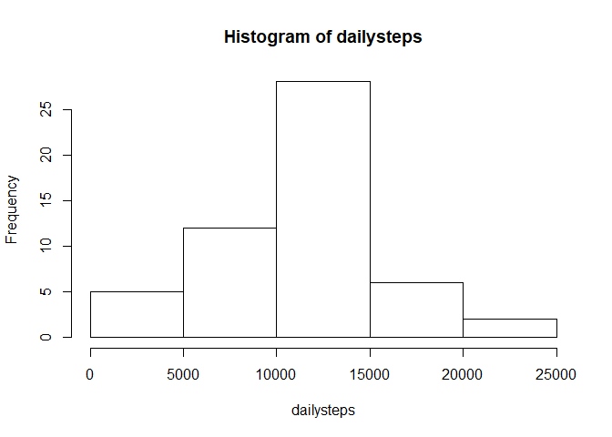
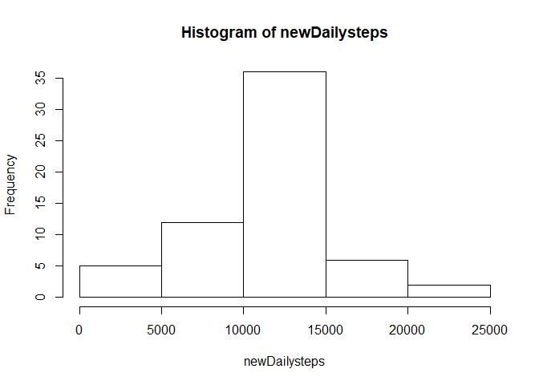
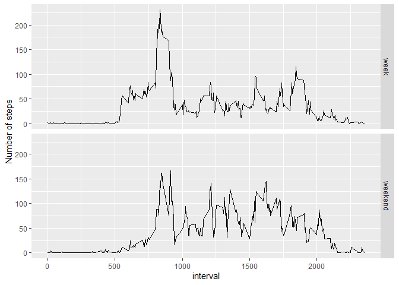

## Loading and preprocessing the data
This code reads the data from the zip-file and stores it in R object activity.

```r
unzip("activity.zip")-> file
read.csv(file, header = T, sep = ",")->activity
```

## What is mean total number of steps taken per day?

Calculate steps per day and plot a histogram

```r
tapply(activity$steps, activity$date, sum)->perday
dailysteps <- as.vector(perday)
hist(dailysteps)
```

<!-- -->

Calculate mean and median steps per day

```r
mean(dailysteps, na.rm = T)
```

```
## [1] 10766.19
```

```r
median(dailysteps, na.rm = T)
```

```
## [1] 10765
```

## What is the average daily activity pattern?

Calculate average steps per interval accross all days

```r
activityClean <- subset(activity, !is.na(steps))
aggregate(activityClean$steps, list(activityClean$interval), mean) -> perinterval
colnames(perinterval) <- c("interval","average")
```

Plot time series and select interval with max average steps
This code chunk plots the time series and prints the interval with the maximum number of steps

```r
with(perinterval, plot(interval, average, type = "l"))
```

<!-- -->

```r
maxinterval <- subset(perinterval, average==max(perinterval$average)) ##or use which.max()
maxinterval[1]
```

```
##     interval
## 104      835
```

## Imputing missing data
This code selects the datapoints with NA values and counts them

```r
subset(activity, is.na(steps))-> missing
nrow(missing)
```

```
## [1] 2304
```

This code uses the imputeTS and dplyr packages to group the data per interval and subsitute the NA values with mean values per interval. The result is stored in a new R object newActivity.

```r
##install.packages("imputeTS")
library(imputeTS)
library(dplyr)
grouped <- group_by(activity, interval) 
grouped <-mutate(grouped, steps = na_mean(steps))
ungroup(grouped)->newActivity
```

With the imputed dataset, the histogram is plotted again.
Below, the sum, mean and median are calculated again.

```r
tapply(newActivity$steps, newActivity$date, sum)->newPerday
newDailysteps <- as.vector(newPerday)
hist(newDailysteps)
```

<!-- -->

```r
mean(newDailysteps)
```

```
## [1] 10766.19
```

```r
median(newDailysteps)
```

```
## [1] 10766.19
```
What happened, is that the mean remains the same as before, while the median shifts from 10765 to the mean value, 10766.19

## Are there differences in activity patterns between weekdays and weekends?
Add weekday factor value and average steps per week or weekend
This code adds a weekday factor and average steps per week or weekend, stored in a new object called summary. It then produces a panel plot per week/weekend with the average steps (y axis) per interval (x axis).

```r
newActivity$weekday <- as.factor(weekdays(as.Date(newActivity$date)))
newActivity$week <- as.factor(
      if_else(newActivity$weekday=="Saturday"|newActivity$weekday=="Sunday",
              "weekend", "week")
      )
group_by(newActivity,week,interval)->grouped3
summarise(grouped3, mean(steps))->summary
```

```
## `summarise()` regrouping output by 'week' (override with `.groups` argument)
```

```r
library(ggplot2)
qplot(interval,`mean(steps)`,data = summary, 
      geom="line", facets = week~., ylab ="Number of steps")
```

<!-- -->
